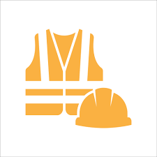
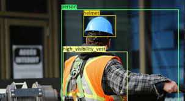
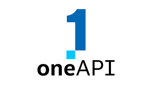

# oneAPI-Hackathon
A team project submission in the Intel oneAPI hackathon conducted at Christ University
 

    
  </a>

  <h3 style="background-color:DodgerBlue;"align="center"><B></B>TITLE: PPE DETECTION FOR INDUSTRIAL WORKERS👷🏻🚧🏗🦺</h3>

  

## ABOUT THE PROJECT
    
### 💪 MOTIVATION 
In the dynamic setting of construction sites, where the cacophony of progress resonates through machinery and human endeavor, the accurate identification of fundamental personal protective equipment (PPE) elements such as helmets and vests holds undeniable significance. The driving force behind advancing PPE detection technology lies in the critical need not only to distinguish their presence or absence but also to precisely determine adherence to safety protocols. This distinction between compliance and non-compliance underlines a compelling motivation to enhance safety measures. Every correctly identified helmet and vest, or the lack thereof, reinforces an earnest commitment to safeguarding lives. This endeavor underscores the dedication to ensuring that each individual entering the construction site is adequately equipped to face potential risks.

###  📌PROBLEM STATEMENT
To develop an advanced computer vision system for accurately identifying personnel wearing appropriate personal protective equipment (PPE) in industrial sites. The solution aims to enhance workplace safety, compliance, and operational efficiency by proactively ensuring adherence to safety protocols.

  

### 🌎 ENHANCING SAFETY FOR WORKERS AND SOCIETAL ADVANCEMENT 
As nations progress and economies thrive, infrastructure development becomes a cornerstone of growth. Roads, bridges, buildings, and other vital structures emerge from the collaborative efforts of construction workers. Beyond mere presence or absence, the finesse in identifying adherence to safety protocols drives the advancement of PPE detection technology. This nuanced distinction bears a significant motivation: **to strengthen safety measures and fortify lives by precisely identifying construction workers who are not wearing the required safety gear as well as by making sure that every worker is adequately equipped to deal with potential hazards.**

* Its core function is to establish construction sites as secure zones.
* By ensuring every worker wears essential protective gear, the impact extends far beyond site boundaries.
* Construction companies benefit from an enhanced reputation for prioritizing safety, attracting skilled labor and gaining public confidence.

### 🚧 TOOLS USED FOR THE PROJECT
✔ **Intel oneAPI**  →→→ oneDNN toolkit
✔ **Jupyter Notebook**  (Python)
✔ **PyCharm** (Python)
✔ **Streamlit** (Deployment)
✔ **Tensorflow** (Model building)

### ☆ Intel oneAPI  

oneAPI is a specification that is open and standards-based, supporting multiple architecture types including but not limited to GPU, CPU, and FPGA. The spec has both direct programming and API-based programming paradigms.The direct programming model provides a flexible, modern C++ language that allows developers to write parallel algorithms and integrate them into existing C++ codebases. Compilers can then take this expressed parallelism and target CPUs, GPUs, FPGAs, and other hardware.
**oneDNN toolkit**
The Intel® oneAPI Deep Neural Network Library (oneDNN) provides highly optimized implementations of deep learning building blocks. With this open source, cross-platform library, deep learning application and framework developers can use the same API for CPUs, GPUs, or both—it abstracts out instruction sets and other complexities of performance optimization.

<b>📄 RESOURCES: </b>

   <table>
   <tr>
    <td><a href="https://universe.roboflow.com/binary-brains/ppe-detection-npas4/dataset/2"> ▸ View Dataset</a></td>
   </tr>
   </table>
**TEAM NAME : PSN-3**
**TEAM MEMBERS** :
<a href="https://github.com/namratas798">1. Namrata Singh</a>   
<a href="https://github.com/Prakriti-Bhatt">2. Prakriti Bhatt</a>
<a href="https://drive.google.com/file/d/1FttMlM96K5njpDYt_v4MtVvyPX62REhj/view">3. Saranya Bandaru</a>
